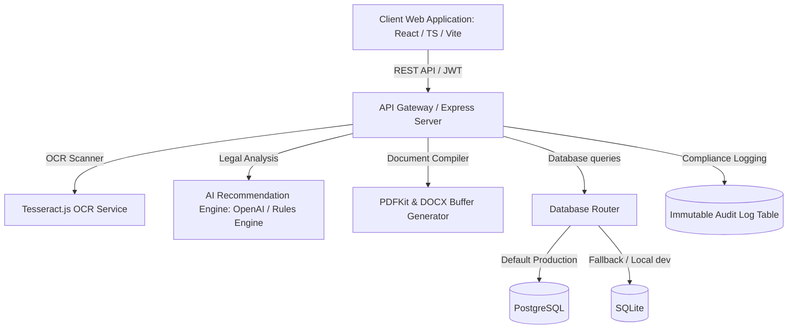

# CrimeGPT - Solution Document & Architecture Specifications

## 1. Executive Summary
CrimeGPT is a state-of-the-art AI-powered Criminal Case Documentation and Legal Intelligence Platform developed specifically for Indian Police Departments. It addresses the operational and legal complexities introduced by the transition from colonial-era laws—the Indian Penal Code (IPC), Code of Criminal Procedure (CrPC), and Indian Evidence Act (IEA)—to the modernized statutes: the **Bharatiya Nyaya Sanhita (BNS)**, **Bharatiya Nagarik Suraksha Sanhita (BNSS)**, and **Bharatiya Sakshya Adhiniyam (BSA)**.

By integrating automated OCR processing, intelligent legal mappings, a digital case diary, multilingual document generation, and an immutable audit trail, CrimeGPT streamlines the police investigation workflow from FIR registration to court presentation, ensuring legal compliance and reducing administrative bottlenecks.

---

## 2. Problem Statement & Modern Context
On **July 1, 2024**, India enacted three monumental legal reforms to replace colonial criminal jurisprudence:
* **BNS** (Bharatiya Nyaya Sanhita) replaced the **IPC** (Indian Penal Code)
* **BNSS** (Bharatiya Nagarik Suraksha Sanhita) replaced the **CrPC** (Code of Criminal Procedure)
* **BSA** (Bharatiya Sakshya Adhiniyam) replaced the **IEA** (Indian Evidence Act)

### Operational Challenges:
1. **Legal Translation Friction**: Investigating Officers (IOs) trained under the older codes face difficulty mapping crime incidents to the new sections of the BNS/BNSS/BSA.
2. **Paperwork Overhead**: Preparing official police communications (e.g., Remand Applications, Medical Examination Requests, Seizure Memos) in multiple languages consumes significant field-investigation time.
3. **Chain of Custody & Audit Compliance**: Ensuring that case timelines and evidence collections are recorded chronologically, immutably, and transparently is critical for judicial admissibility.
4. **Digitization Gaps**: Physical FIRs and witness statements must be manually transcribed into case records, leading to delays and typographical errors.

---

## 3. Proposed Solution & Value Propositions
CrimeGPT provides a unified digital portal to resolve these issues:
* **AI-Assisted Legal Mapping**: Translates narratives to relevant BNS, BNSS, and BSA sections alongside their older IPC, CrPC, and IEA counterparts.
* **Optical Character Recognition (OCR)**: Scans physical FIR documents using Tesseract OCR, automatically extracting crime details, victim/accused metadata, and incident times.
* **Digital Investigation Diary**: Creates an interactive chronological timeline tracking all major investigation milestones (statements, seizures, arrests) matching BNSS compliance.
* **Multilingual Document Generation**: Automatically compiles legally compliant requests (Remand, Medical, Seizure, Custody) in English, Hindi, and Gujarati, with options to download as PDF or Microsoft Word DOCX.
* **Role-Based Access Control (RBAC)**: Enforces security clearances with specific portals for Investigating Officers (IOs), Station House Officers (SHOs), Legal Advisors, and System Administrators.
* **Immutable Compliance Audit Trail**: Automatically logs every database action, operator details, and modified parameters in a secure audit system for administrative verification.

---

## 4. System Architecture & Tech Stack



### Technology Stack:
* **Frontend**: React (TypeScript), Vite, TailwindCSS (for responsive UI), Context API (Authentication & Translation State Management).
* **Backend**: Node.js, Express.js (TypeScript), JWT Authentication, Multer (multipart file upload).
* **Database**: PostgreSQL (Production) / SQLite (Zero-configuration offline fallback).
* **AI & Parsing Services**: OpenAI GPT-4o-mini (LLM Recommendations), Local Legal Keyword Translation Matrix (Offline Fallback), Tesseract.js (On-server OCR text parsing).
* **Document Services**: PDFKit (Vector PDF builder), docx package (OpenXML Word document builder).

---

## 5. Database Schema & Data Models
The database includes five core tables designed for legal consistency and tracking:

### 5.1. `users`
Stores authenticated users and roles mapping to police departments.
```sql
CREATE TABLE users (
  id SERIAL PRIMARY KEY,
  username VARCHAR(50) UNIQUE NOT NULL,
  password_hash VARCHAR(255) NOT NULL,
  name VARCHAR(100) NOT NULL,
  role VARCHAR(20) NOT NULL, -- 'IO', 'SHO', 'LEGAL_ADVISOR', 'ADMIN'
  police_station VARCHAR(100),
  role_credential VARCHAR(100), -- Badge/Bar ID
  created_at TIMESTAMP DEFAULT CURRENT_TIMESTAMP
);
```

### 5.2. `cases`
Central repository for FIR registration and case records.
```sql
CREATE TABLE cases (
  id SERIAL PRIMARY KEY,
  case_number VARCHAR(50) UNIQUE NOT NULL,
  fir_number VARCHAR(50) UNIQUE NOT NULL,
  police_station VARCHAR(100) NOT NULL,
  date_of_incident DATE NOT NULL,
  crime_type VARCHAR(100) NOT NULL,
  location VARCHAR(255) NOT NULL,
  narrative_description TEXT NOT NULL,
  victim_name VARCHAR(100) NOT NULL,
  victim_address TEXT,
  victim_contact VARCHAR(20),
  accused_name VARCHAR(100) NOT NULL,
  accused_address TEXT,
  accused_photo_url TEXT,
  witness_name VARCHAR(100),
  witness_contact VARCHAR(20),
  status VARCHAR(20) DEFAULT 'ACTIVE', -- 'ACTIVE', 'ARRESTED', 'CLOSED'
  created_at TIMESTAMP DEFAULT CURRENT_TIMESTAMP,
  created_by INTEGER REFERENCES users(id)
);
```

### 5.3. `evidence`
Maintains file lists of recovered weapons, physical evidence, and digital logs.
```sql
CREATE TABLE evidence (
  id SERIAL PRIMARY KEY,
  case_id INTEGER REFERENCES cases(id) ON DELETE CASCADE,
  type VARCHAR(100) NOT NULL,
  file_name VARCHAR(255) NOT NULL,
  file_url TEXT NOT NULL,
  created_at TIMESTAMP DEFAULT CURRENT_TIMESTAMP
);
```

### 5.4. `case_diary`
The chronological Investigation Diary (timeline logs) mandated by BNSS.
```sql
CREATE TABLE case_diary (
  id SERIAL PRIMARY KEY,
  case_id INTEGER REFERENCES cases(id) ON DELETE CASCADE,
  timestamp TIMESTAMP DEFAULT CURRENT_TIMESTAMP,
  entry_type VARCHAR(50) NOT NULL, -- 'CASE_REGISTERED', 'STATEMENT_RECORDED', 'EVIDENCE_ADDED', 'ARREST_MADE', 'CASE_CLOSED'
  description TEXT NOT NULL,
  officer_name VARCHAR(100) NOT NULL
);
```

### 5.5. `audit_logs`
Immutable compliance database tracking admin and officer activities.
```sql
CREATE TABLE audit_logs (
  id SERIAL PRIMARY KEY,
  user_id INTEGER REFERENCES users(id) ON DELETE SET NULL,
  username VARCHAR(100) NOT NULL,
  action VARCHAR(100) NOT NULL,
  timestamp TIMESTAMP DEFAULT CURRENT_TIMESTAMP,
  modified_data TEXT -- JSON parameters stringified
);
```

---

## 6. Functional Modules Breakdown

### 6.1. Authentication & Role-Based Access Control (RBAC)
Four specific roles are configured to ensure segregation of duties:
1. **Investigating Officer (IO)**: Can register new cases, upload OCR FIR documents, run AI section suggestors, log evidence/statements, and generate letters.
2. **Station House Officer (SHO)**: Has overseeing authority. Can approve case filings, book arrests, transition case status (`ACTIVE` -> `ARRESTED` -> `CLOSED`), and audit precinct statistics.
3. **Legal Advisor**: Review-only clearance. Accesses case summaries, diary timelines, and AI suggestions to draft charge sheets.
4. **System Administrator**: IT governance. Accesses the read-only **Compliance Audit Trail** logging all API actions, timestamps, and parameters.

### 6.2. Scanned FIR OCR Scanner
Powered by Tesseract.js, the system processes scanned images or PDF files of FIRs. It runs a regex parser against the extracted text to identify and auto-populate:
* FIR Numbers
* Police Station Names
* Incidents / Crime Types
* Dates & Names of Victims/Accused
This speeds up data input from a 15-minute manual typing chore to under 10 seconds.

### 6.3. AI Legal Assistant & Code Translation Matrix
When provided with an incident narrative, the system evaluates the text using a dual-layered approach:
1. **Online LLM Model**: Leverages `gpt-4o-mini` with structured JSON output formatting, parsing the text to find precise legal matches across BNS, BNSS, BSA, and older IPC/CrPC/IEA codes.
2. **Offline Rule-Based Matcher**: If the API key is missing or the server is offline, the system matches keywords against a pre-loaded JSON database containing detailed statutory references and landmark Supreme Court judgments (e.g., *Bhajan Lal*, *K.M. Nanavati*, *Lalita Kumari*).

### 6.4. Digital Investigation Diary (Timeline)
Mandated by Section 172 of the CrPC and corresponding BNSS provisions, every investigation requires a case diary. CrimeGPT automates this via an interactive timeline. Actions such as adding witness statements, recovering evidence, booking arrests, or submitting case closures automatically append structured, dated logs to the database case diary.

### 6.5. Multilingual Letter Generator
Investigating officers must submit requests to medical staff, magistrates, and jail wardens. CrimeGPT generates these dynamic letters in:
* **English** (Standard legal filings)
* **Hindi** (Northern and central states)
* **Gujarati** (Western states/regional support)
* **Marathi** (Western regional support)

Letters generated:
1. **Remand Request**: Application to Metropolitan Magistrate for 14-day police custody under Section 187 BNSS.
2. **Medical Exam Requisition**: Request to Medical Officer for clinical examination under Section 51 BNSS.
3. **Seizure Memo**: Receipt documenting recovered materials under Section 185 BNSS.
4. **Custody Requisition**: Request to prison warden for judicial custody intake.

---

## 7. Transition Reference Table: IPC vs. BNS
The system implements a legal transition dictionary mapping common offenses:

| Offense | Old IPC Section | New BNS Section | Procedural Code (Old CrPC -> New BNSS) | Evidentiary Rule (Old IEA -> New BSA) |
| :--- | :--- | :--- | :--- | :--- |
| **Murder** | Section 300 / 302 | Section 101 / 103(1) | Inquest: Sec 174 -> Sec 176 BNSS | Dying Declaration: Sec 32(1) -> Sec 32(1) BSA |
| **Theft** | Section 378 / 380 | Section 303 / 305 | Search/Seizure: Sec 102 -> Sec 185 BNSS | Presumption: Sec 114 -> Sec 119 BSA |
| **Hurt / Grievous Hurt** | Section 323 / 325 | Section 115 / 117 | Medical Exam: Sec 53 -> Sec 184 BNSS | Expert Opinion: Sec 45 -> Sec 45 BSA |
| **Cheating & Forgery** | Section 420 / 468 | Section 318 / 336 | Property Attachment: Sec 91 -> Sec 105 BNSS | Electronic Records: Sec 65B -> Sec 63 BSA |
| **Kidnapping for Ransom**| Section 359 / 364A | Section 137 / 140 | Recording Statement: Sec 164 -> Sec 164 BNSS | Presumption of Custody: Sec 114 -> Sec 114 BSA |
| **Rape & Outrage Modesty**| Section 375 / 376 / 354| Section 63 / 64 / 74 | Medical Probe: Sec 164A -> Sec 184 BNSS | Presumption of Consent: Sec 114A -> Sec 114A BSA|

---

## 8. Verification & Deployment Plan
The platform is built with cross-platform and environment flexibility:
1. **Local Development Mode**: Sets `USE_SQLITE=true` to write database tables to `crimegpt.sqlite` locally. Requires zero SQL server setups.
2. **Production Mode**: Connects to a PostgreSQL pool. Automatically initializes and updates database constraints on system boot.
3. **Proxy Setup**: Vite frontend acts as a proxy, mapping `/api` endpoints directly to Node.js port 5000, eliminating CORS issues.
